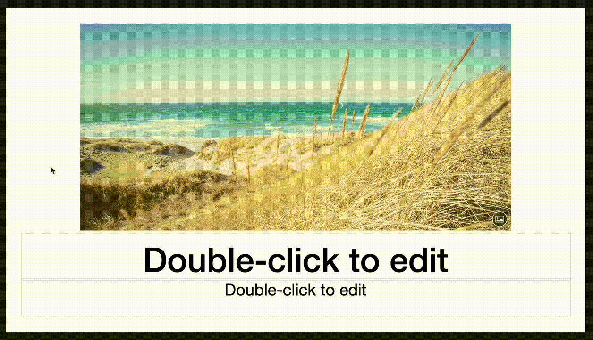

# CircleAroundCursor

This is a simple macOS app that draws a circle around the mouse cursor.



## Build

```
git clone https://github.com/valosekj/CircleAroundCursor.git
cd CircleAroundCursor

swiftc -o CircleAroundCursor CircleAroundCursor.swift -framework Cocoa
```

Test it:

```
./CircleAroundCursor
```

(Stop it with `Ctrl+C`.)

You can specify the radius of the circle in pixels:

```
./CircleAroundCursor 100
```

## Usage with Raycast

To toggle the CircleAroundCursor app with Raycast, add the `toggle-circle-cursor.sh` to the Raycast scripts folder.
